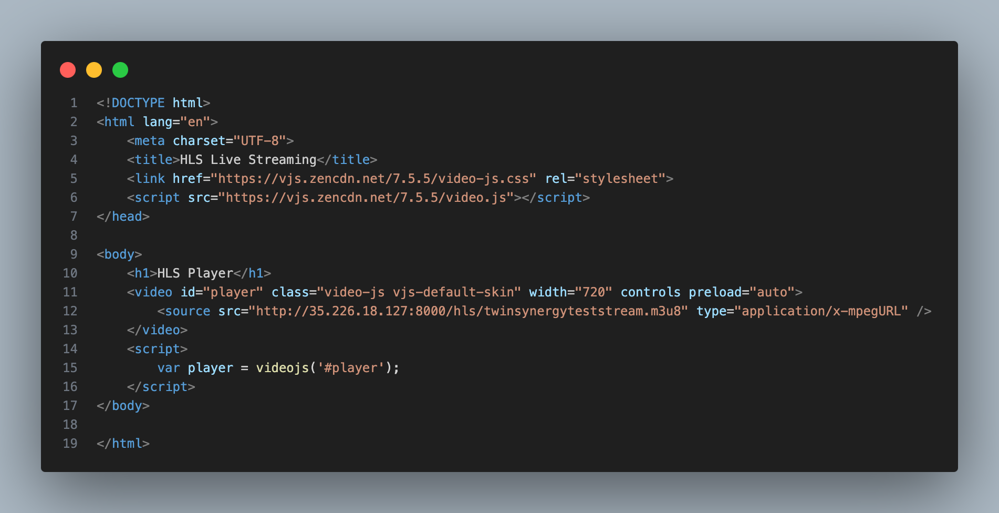
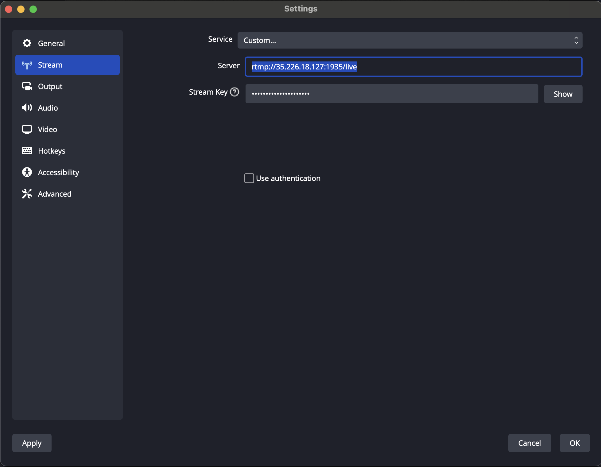
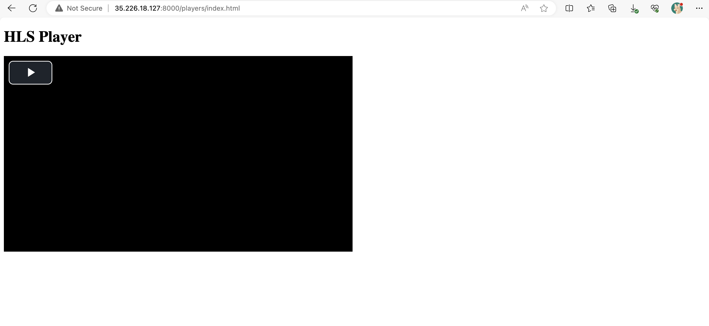
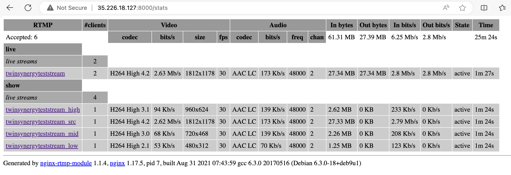

# ขั้นตอนการสร้าง rtmp-hls Server
## 1.สร้างหน้า HTML file สำหรับ เล่นวิดีโอ 
โดยไฟล์จะอยู่ใน Path:
```
players/index.html
```
อย่าลืม เปลี่ยน IP เป็น IP ของ Server
และ เปลี่ยน Port ให้ตรงกับ Docker ด้วยครับ



## 2.Run rtmp-hls Server ด้วย Docker
ซึ่งในที่นี้จะใช้

```
Key: twinsynergyteststream
IP: 35.226.18.127
Stream-Port: 1935
WebPreview-Port: 8000
```

แล้ว Run ด้วยคำสั่ง:

```
docker run -d -p 1935:1935 -p 8000:8080 -v $(pwd)/players:/usr/local/nginx/html/players alqutami/rtmp-hls
```


## 3.Stream ผ่าน โปรแกรม OBS
```
Stream-Server: rtmp://35.226.18.127:1935/live
Stream-Key: twinsynergyteststream
```



## 4.เปิด Preview URL เพื่อดูวิดีโอ
ลองเล่นวิดีโอ


check stat

