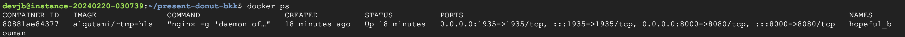

# ขั้นตอนการสร้าง rtmp-hls Server
## 1.สร้างหน้า HTML file สำหรับ เล่นวิดีโอ 
โดยไฟล์จะอยู่ใน Path:
```
players/index.html
```
อย่าลืม เปลี่ยน IP เป็น IP ของ Server
และ เปลี่ยน Port ให้ตรงกับ Docker ด้วยครับ


## 2.Run rtmp-hls Server ด้วย Docker
ซึ่งในที่นี้จะใช้

```
Key: twinsynergyteststream
IP: 35.226.18.127
Stream-Port: 1935
WebPreview-Port: 8000
```

แล้ว Run ด้วยคำสั่ง:

```
docker run -d -p 1935:1935 -p 8000:8080 -v $(pwd)/players:/usr/local/nginx/html/players alqutami/rtmp-hls
```



## 3.Stream ผ่าน โปรแกรม OBS
```
Stream-Server: rtmp://35.226.18.127:1935/live
Stream-Key: twinsynergyteststream
```


## 4.เปิด Preview URL เพื่อดูวิดีโอ
ลองเล่นวิดีโอ


check stat


# Credit

[การติดตั้ง rtmp-hls with docker](https://twinsynergy.co.th/rtmp-hls-docker-%E0%B8%A1%E0%B8%B2%E0%B8%97%E0%B8%B3-streaming-%E0%B9%83%E0%B8%8A%E0%B9%89%E0%B8%87%E0%B8%B2%E0%B8%99%E0%B9%80%E0%B8%A5%E0%B9%88%E0%B8%99%E0%B8%9A%E0%B8%99%E0%B9%80%E0%B8%A7%E0%B8%9B/)

[ข้อมูลเกี่ยวกับ streaming-protocol](https://multimedia.riverplus.com/streaming-protocol-%E0%B8%84%E0%B8%B7%E0%B8%AD%E0%B8%AD%E0%B8%B0%E0%B9%84%E0%B8%A3/)
